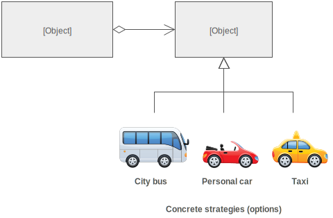

# ISI3 TP 1a: Design Pattern Strategy
Laëtitia Matignon

> Le rapport est à saisir dans le ficher [RAPPORTTP1a.md](RAPPORTTP1a.md) en utilisant le [formalisme MarkDown](https://guides.github.com/features/mastering-markdown/).

## Exercice 1: Calculette

**Enoncé/contexte**: Modéliser le concept d'une Calculette. 

### Faites une calculette

- complétez la classe [classe Calculette](calculette/src/main/java/calculette/Calculette.java) pour pouvoir réaliser l'opération d'addition entre deux réels.
- complétez la classe [classe Main](calculette/src/main/java/calculette/Main.java) pour "utiliser" votre calculette.
- ajoutez la soustraction.
- ajoutez la multiplication
- ajoutez la division

### Discutons

- présentez votre solution
- conclusion(s) ?

### Rappel: le pattern Strategy

*Le pattern Strategy a pour objectif d'adapter le comportement et les algorithmes d'un objet en fonction d'un besoin sans changer les interactions de cet objet avec les clients*.

- la **stratégie**, c'est l'interface qui va définir la(les) méthode(s) des stratégies(options) que l'on va implémenter
- les **stratégies**, *(les opérations de la calculette par exemple)* vont implémenter l'interface **stratégie**
- le **contexte**, c'est la classe qui va utiliser les stratégies pour faire toujours la même action mais avec un résultat différent à chaque fois (par exemple notre classe `Calculette` qui va utiliser des opérations)

> autre exemple: modes de transport

## Exercice 2: Calculette et Strategie

> Comment ajouter des opérations à la classe `Calculette` sans être obligé de la modifier à chaque fois?

- re-faites la calculette en utilisant le pattern **Strategy**

### Discutons

- présentez votre solution
- conclusion(s) ?

## Exercice 3: Happy Hour 

**Enoncé/contexte**: Modéliser le concept d'happy hour dans un pub. Le serveur sert des bières sur lesquelles il peut appliquer des réductions.
- le serveur est le contexte
- les réductions sont les stratégies

**À faire**: dans le projet `/beers`
- ajoutez le code nécessaire pour que les tests fonctionnent (exécutez la classe [classe HappyHourTest](beers/src/test/java/pub/HappyHourTest.java) en tant que Test JUnit)
- ajoutez une réduction de 50%
- complétez la classe de test [classe HappyHourTest](beers/src/test/java/pub/HappyHourTest.java) et vérifier le bon fonctionnement de cette nouvelle réduction.

